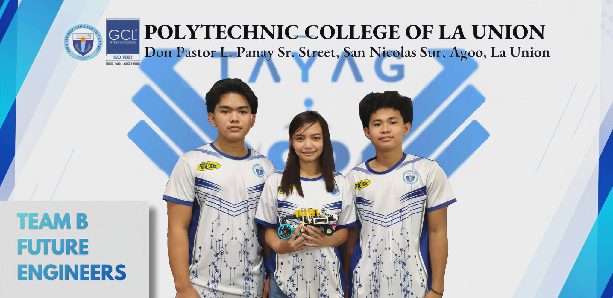
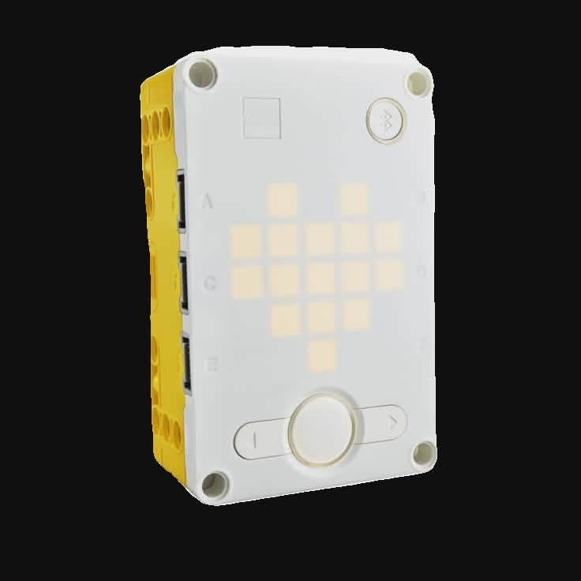

# WRO-PH-FUTURE-ENGINEERS
Introducing Polytechnic College of La Union (PCLU) 's Team B of Future Engineer Category on WRO-Philippines 2026, Limitlessly Soaring with Technology
# <b>📄 Table of Contents </b>
- 👤 <b>[1. Introduction](#1-introduction)</b> 
    - [1.1 Team Overview ](#11-team-overview)
    - [1.2 Team Coordination](#12-team-coordination)
    - [1.3 Participation Motives](#13-participation-motives)
- 🚗 <b>[2. About the Robotic Vehicle](#2-about-the-robotic-vehicle)</b>
    - [2.1 Logic of the Robotic Vehicle](#21-logic-of-the-robotic-vehicle)
    - [2.2 Prototype](#22-prototype)
    - [2.3 Flow Diagram](#23-flow-diagram)
    - [2.4 Why LEGO Spike Prime?](#24-why-lego-spike-prime)
- ⚙️ <b>[3. Mobility Management](#3-mobility-management)</b>
    - [3.1 Bill of Materials](#31-bill-of-materials)
    - [3.2 Wiring Diagram](#32-wiring-diagram)
    - [3.3 Steering Mechanism](#33-steering-mechanism)
    - [3.4 Driving Mechanism](#34-driving-mechanism)
- 🔋 <b>[4.Power Sense Management](#4-power-sense-management)</b>
    - [4.1 Power Supply](#41-power-supply)
        - [4.1.1 Technic™ Large Hub Rechargeable Battery](#411-technic-large-hub-rechargeable-battery)
    - [4.2 Sensors](#42-sensors)
        - [4.2.1 Distance Sensors](#421-distance-sensors)
    - [4.3 Camera](#43-camera)
- 🤖 <b>[5. Managing Challenges](#5-managing-challenges)</b>
    - [5.1 Open Challenge](#51-open-challenge)
    - [5.2 Obstacle Challenge](#52-obstacle-challenge)
 - [6. Weekly Logs](#6-weekly-logs)
 - [7, Step By Step Building Instructions](#7-step-by-step-building-instruction)
      
    


# <b>1. Introduction</b>
<div align="center"></img></div>
<h2 align="center"><i><b>Team and Vehicle Name: Tayag</b></i></h2>
This presents the Engineering Document of Polytechnic Colege of La Union-Team B as participants of the category Future Engineer on WRO Philippines 2026.
 
This repository includes information about our robot's mechanism, integration, logic and it also includes our journey on building the robot. This is supported by resources such as images, diagrams and recorded demonstration enable to provide clear understanding and transparency about the work.

# Team and Vehicle Name
<div align="center"></div>

## <div align="center"> TAYAG </div>

The name “Tayag” was thoughtfully chosen to represent both the team’s identity and the team's creation--the robot vehicle. 
It comes from the word “tayag,” which means high or elevated. It reflects the our goal of reaching greater heights through innovation, creativity, and advanced technology. In a deeper sense, “Tayag” symbolizes the team’s ambition to rise above challenges and continuously improve.

Just like something that stands high and prominent, the team aims to develop a robot that performs with precision, intelligence, and balance.
The name captures the idea of pushing limits and rising above average results.

It's meaning is further strengthened by the team’s inspiration from the Philippine eagle, that is known for its powerful flight and ability to soar at great heights, the Philippine eagle represents strength, focus, and dominance in its environment. This symbol influenced the team’s mindset, encouraging them to aim high, stay sharp, and move with purpose, just like the eagle in flight. The team made the connection between Tayag and the Philippine eagle perfectly aligns with the theme: “limitlessly soaring with technology.” 

Just as the eagle soars freely across vast skies, the team envisions their robot overcoming obstacles and achieving success without limits.
In essence, Tayag is more than just a name, it represents elevation, strength, and the team's boundless ambition. 
It reflects a team that is determined to rise, innovate, and soar beyond expectations through the power of technology.


 ## 1.1 Team Overview
| Picture | Name | Age | About Us
| :---: | :---: | :---: | :---: |
|  | Aliana Marie L. Marquez | 17 | She is the technical writer/protyper of the PCLU Team B under the category Future Engineer on WRO Philippines 2026. She enjoys writing, sketching and painting—typical creative pursuits. She is also explorative and eager to learn, especially when faced with challenges that engaged her intellect. Social:<a href="https://www.instagram.com/ml.yvnx?igsh=MXUzdHVyOXJxN2N6NA==" target="_blank">@ml.yvnx</a>|
|  | Kendrick Nathaniel L. Garcia | 16 |The builder and assistant document writer of the team. He enjoys playing online games and engaging in physical activities such as basketball—both of which sharpen his strategic thinking and teamwork, that is also an essential skills for constructing and troubleshooting the car robot. In combining his creativity and hands-on problem-solving skills he brings their project to life. Social:<a href="https://www.instagram.com/urlazy_kenken?utm_source=ig_web_button_share_sheet&igsh=ZDNlZDc0MzIxNw==" target="_blank">@urlazy_kenken</a>|
|  | Naithan T. Velasco | 17 | The brain of the team. He serves as both programmer and builder. He is drawn to problem-solving activities such as chess, solving Rubik's cubes, and playing online games, which sharpen his logical and thinking. He is also an active badminton player. His programming and building expertise are essential for bringing the team's autonomous car robot to life, from coding its navigation logic, to assembling and designing the robot. Social:<a href="https://www.instagram.com/naithanvelasco/?utm_source=ig_web_button_share_sheet" target="_blank">@naithanvelasco</a>

| Formal Picture | Funny Picture |
| :---: | :---: |
| ||
 ## 1.2 Team Coordination
 We have the team structured itself with clear roles and regular communication to ensure progress throughout the proccess. We have different roles, the role—programmer, builder, technical writer, each are designated for each tasks.
 For us to have a seamless collaboration, each shared a different vision and opinion to improve our project. Beyond tasks execution, se hsve to perform mutual accountability and peer learning. To us balanced structure of roles, frequent communication and a shared reponsibility would make the our team to work more efficiently and move steadily from the start up inro the competition.
|  |
| :---: |
| Team Photo With Coach |

Team Members: **Aliana Marquez, Naithan Tuvera, Kendrick Garcia** 

Team Coach: **Michael James Estipular Ergino**

 ## 1.3 Participation Motives
 We are honored to represent Polytechnic College of La Union in the WRO Philippines 2026, under the Future Engineer category. We believe that this competition's challenges is the best way to learn and prepare on rapidly changing technology.  Representing our school gives us extra motivation to push harder and make our istitution proud. <br>This competition gives us the opportunity to showcase our skills in STEM and allows us to apply it through robotics.  Ultimately, the team is motivated by the purpose of contributing to the future mobility as we vision this activity as a stepping stone toward real-world solution. Together, we will join this competition to build something meaningful, grow as engineers and make our school proud.

 # <b>2. About the Robotic Vehicle</b>


 ## Robot's Specification
 |Weight| 57.60g|
 |---: | ---: |
 |Length| 24cm |
 |Width| 14cm |
 |Height| 21cm |
 

 ## 2.1 Logic of the Robotic Vehicle
 The team developed the robotic vehicle using the LEGO Spike Prime System together with the design, sensors and programming to perform autonomous in two different challenges. This system can be used to both the Open Challenge and the Obstacle Challenge:
1. The operation begins when the robot is powered on using the Start button. Once activated, the robot will do its programmed instructions, which decides whether it will go in a clockwise or counterclockwise direction. This command build the robot's navigation throughout the lap.

2. After activation, the drive motors move the robot forward along the track. As it travels, the robot continuously monitors its surroundings using its onboard sensors to maintain accurate movement and respond to conditions on the course.

3. The robot uses ultrasonic distance sensors to make turns. These sensors measure the distance between the robot and nearby walls. When a  distance is detected, the robot executes the turning maneuver, allowing it to follow the course correctly. The same sensors are also used for obstacle detection and avoidance during the Obstacle Challenge.

4. In the Obstacle Challenge, the robot must successfully run through the course while avoiding obstacles and remaining its distance from the walls. Using data gathered from the camera and sensors, the robot adjusts its movement to avoid collisions and continue to run.

5. The robot continues until its objective is completed. In the Open Challenge, the robot stops after successfully completing three (3) laps. In the Obstacle Challenge, the robot stops only after completing three (3) laps while  detecting and avoiding all obstacles. Once these conditions have been met, the robot will automatically ends operation.

 ## 2.2 Prototype 
 
 The first design/prototype of the robotic vehicle included distance sensors on each side, totalling two sensors. it also had one color sensor underneath the robot, which was used to detect the orange and blue lines that determine the vehicle's turning (clockwise or counterclockwise).

 During the initial testing, the robot performed well, however, something was lacking. It was observed that the vehicle moved very slowly, even though it was already set to the maximum speed in the program. The team determined that the issue was due to the design.

 The prototype was found to be heavy, large and disproportionate which negatively affected its performance. As a solution, the team improved its base. The team redesigned the robot to be lighter and smaller than the previous version. Additionally, the team also changed the wheels and improved both the steering and driving mechanism to achieve a smoother and more efficient run.


 ## 2.3 Flow Diagram
 ## Open Challenge Flow Chart
 ```mermaid
 flowchart TD
    A[pre-operation check] --> B(position robot)
    B --> C(straight run)
    C --> D{if distance sensor detected the walls close }
    D --Yes--> E(choose direction)
    D --NO--> F(run with gyro) 
    F -->D
    E --> G{if right distance sensor is:}
    G --close--> H(backward in x rotation)
    G --far--> I(backward in x rotation)
    H --> J(counter-clockwise)
    I -->K(clockwise)
    J -->L[wait until gyro is 90 degrees]
    K -->L
    L -->M(straight steering)
    M -->N{turn count}
    N -->E
    N -->O(stop:12 count)
    O -->P[end program]
 ```
 ## Obstacle Challenge Flow Chart
 ```mermaid
 flowchart TD
 B[pre opration check]
   B --> C(position robot)
   C --> D(start run)
   D --> E{wall detection}
   E --close--> F(counter-clockwise)
   E --far--> G(clockwise)
   F -->H[get out of parking]
   G -->H
   H -->I{if the camera detected color:}
   I --red--> J(Right)
   I --green--> K(Left)
   J --> L( if the distance sensor detected the walls close:)
   K -->L
   L -->M(it will run backward)
   M -->N(then the robot will turn clockwise and counter-clockwise)
   N -->O[turn count]
   O -->I
   O -->P( 12 count stop)
   P -->Q(park)
   Q -->R[end program]


 ```

 ## 2.4 Why LEGO Spike Prime? 
 The team selected the LEGO spike prime for the autonomous robot car due to ease of use, versatility and suitability for educational robotics. It offers an efficient combination of hardware, software, and flexibility for building autonomous systems.
-  The SPIKE Prime hub acts as an all-in-one controller with built-in processing, ports, and battery, which simplifies our wiring and system design. This makes our robot more compact and reliable.
-  the motors and sensors are highly compatible and easy to integrate. The large motor provides enough power for driving, while the medium motor allows precise control for steering. The distance sensors give accurate real-time data, which is essential for wall detection and navigation.
- Another reason is the modularity of LEGO Technic parts. It allows us to quickly build, test, and improve our design, especially for mechanisms like our Parallel steering and differential system.
- SPIKE Prime supports programmable logic, enabling us to create a fully autonomous robot that can make decisions based on sensor input.
Overall, we chose SPIKE Prime because it is reliable, flexible, and well-suited for developing an efficient and accurate autonomous robot
 
 # <b>3. Mobility Management</b>
 ## 3.1 Bill of Materials
| Picture| Components | Quantity | Purpose |
|:---:| :---: | :---: | :---: |
|  |LEGO Technic Large Hub| 1 | used to power the robot
| | Medium Motor | 1 | Used to control the robot’s steering. It rotates the front wheels left or right with angle control, allowing the robot to turn precisely.
| |Large Motor | 1 | Used in the rear driving mechanism to power the back wheels and drive the robot forward. It provides strong power and torque, allowing the robot to move smoothly and carry its weight  during the run. alt="Distancesensors" src="https://github.com/user-attachments/assets/b469a83b-bc39-4444-9bee-46cb3719ebef" />|Distance Sensors | 2 | The distance sensors are used to detect walls that are one placed in front and one on the side. They measure how far the robot is from the walls, helping it avoid collisions and maintain proper distance from the walls.
| |Husky Lense | 1 | Used to detect colored obstacles. It recognizes colors like red and green, allowing the robot to decide whether to turn left or right during the obstacle challenge.
| |Jumper Wire| several were used | Used to connect the HuskyLens camera to the SPIKE Prime hub. They allow data communication between the camera and the hub, so that the robot can receive information about the detected colored obstacles.
| |LEGO Powered Up Function 2 | 1 | connected to jumper wires and is responsible for transporting data from the HuskyLens camera to the SPIKE Prime hub. It enables communication between the camera and the hub, allowing the robot to receive color detection data.

 ## 3.2 Wiring Diagram
 

 ## 3.3 Steering Mechanism
The robot utilizes a parallel steering mechanism, in which both front wheels turn at the same angle and remain parallel to each other during movement. This steering system is powered by a LEGO SPIKE Prime medium angular motor, the motor is responsible for controlling the direction of the robot. The motor is mechanically connected to both front wheels through a combination of linkages and components, allowing the wheels to rotate simultaneously whenever the motor is activated. When the motor turns in one direction, both wheels steer left and when it turns in the opposite direction, both wheels steer right.

Parallel steering ensures that the steering of the robot is synchronized, meaning there is no difference in the angle between the left and right wheels. This applied steering to the robot maintains a stable and predictable path when turning. The use of a medium motor is particularly important because it provides sufficient torque and precise angular control, enabling accurate adjustments in steering angle. That precision required for navigation tasks such as following a path, avoiding walls using distance sensors, and responding to obstacle detection using the camera system.

In terms of design, parallel steering is relatively simple compared to more complex steering geometries. It requires fewer components, easier to assemble, and is also more straightforward to program. Simplicity reduces the chances of mechanical errors and makes troubleshooting easier during testing and development. Additionally, because both wheels move together, the system responds quickly to commands, which improves the robot’s overall responsiveness during challenges such as the open challenge and obstacle challenge.

However, one limitation of parallel steering is that both wheels follow the same angle even when turning along a curved path. It can cause slight slipping or friction between the wheels and the surface, especially during sharper turns, since the inner and outer wheels ideally should follow different radii. But the effect is minimal like the competition track, where turns are generally smooth and predictable.

To sum all the use of parallel steering with the spike primea medium motor provides a balance between simplicity, control, and reliability. It allows the robot to perform consistent and stable turns while keeping the mechanical design efficient and easy to manage, making it highly suitable for the competition requirements.
 ## 3.4 Driving Mechanism
The robot uses a rear-wheel driving mechanism powered by a single SPIKE Prime large angular motor. This motor provides the main source of movement for the robot.

 The motor is connected to a differential system that contains five small internal gears. The purpose of the differential is to distribute power to both rear wheels while allowing them to rotate at different speeds during turns.

The used two large gears, one connected to the large angular motor, it is to transmit power from the motor to the differential. These gears help increase torque and ensure smooth, efficient power transfer. The differential then delivers this motion to the two SPIKE wheels at the back.

Even though we are using only one motor, the differential allows both wheels to move effectively and adjust their speeds when turning. This reduces friction, prevents slipping, and improves stability.

 The team designed the rear driving to be efficient, lightweight, and capable of producing smooth and controlled movement, which is essential for completing the three laps.
 # <b>4. Power Sense Management</b>
 - The robot uses a rechargeable battery included into the spike prime hub, which act as the power source and the main controller. The hub allows simultaneous activity by distributing power to the components while processing data and running the robot.
## 4.1 Power Supply 
### 4.1.1 Technic™ Large Hub Rechargeable Battery
The Spike Prime large hub rechargeble battery was selected as the power source of the autonomous car due to its efficiency and its system integration, also for the following reason:
- The rechargeable battery provides a stable and consistent power supply to all of the components connected to it, including the motors, sensors and the hub.
- The hub also has several ports that allows simultaneous use of:
    - Large motors for driving
    - Medium motor for its steering
     - Distance sensors for wall dectection
     - Camera(Huskylens) for colored obstacle detection
-  It is directly integrated with the Technic hub, that serves as the power source and the main controller. This minimizes potential connection issues.
- the hub itself has a internal sensors such as gyro and accelerometer, that improves the navigation and stability of the robot.    
-  It can also to devices via bluetooth for it to allow program uploading.    
    
 ## 4.2 Sensors
 ### 4.2.1 Distance Sensors
 The robot uses two SPIKE Prime distance sensors as its primary detection. These sensors are responsible for measuring how far the robot is from surrounding walls in real time.

The sensors continuously send distance data to the hub, which processes the information and determines whether the robot is too close or at a safe distance. If the robot detects that it is approaching a wall, the system immediately responds by adjusting the steering.

This adjustment is done through the medium motor controlling the front wheels, allowing the robot to turn smoothly and avoid collision. Because we use two sensors, the robot can better understand its position relative to both sides of the track, improving its accuracy in navigation.

The distance sensors play a critical role in both the open and obstacle challenges. In the open challenge, they guide the robot in maintaining a consistent path around the track. In the obstacle challenge, they work together with color detection to ensure the robot avoids both walls and obstacles effectively. The distance sensors enable real-time decision making, precise safe and efficient movement of the robot.
 ## 4.3 Camera
 The robot uses the HuskyLens camera,a vision-based detection, specifically to recognize colored obstacles during the obstacle challenge.

The HuskyLens is an AI-powered camera that can identify objects such as colors, shapes, or tags. In the project, the team configured it to detect specific colors, the green and red blocks.

When the camera detects a green object, it sends a signal to the hub, and the robot is programmed to turn left. When it detects a red object, the robot turns right. This allows the robot to make decisions based on visual input and distance.

The HuskyLens works together with the distance sensors. While the camera identifies what the object is, the distance sensors ensure the robot maintains a safe distance from walls. This combination improves accuracy and prevents collisions. It adds a vision system to our robot, enabling it to recognize obstacles and respond correctly, which is essential for completing the obstacle challenge successfully.

 # <b>5. Managing Challenges</b>
 ## 5.1 Open Challenge
 For the open challenge, the robot is programmed to complete three full laps while avoiding the surrounding walls and stopping at its exact starting position.

The team used two distance sensors that continuously measure how far the robot is from the walls. These sensors allow the robot to maintain a safe distance and adjust its path.

When the robot detects that it is getting too close to a wall, it automatically sends a signal to the steering system. The medium motor then adjusts the front wheels using our Ackermann steering mechanism, allowing smooth and controlled turning.

At the same time, the rear driving system, powered by a single large motor and supported by a differential, ensures stable and continuous movement even during turns.

The team also implemented a lap-counting logic in our program. The robot tracks its position and counts each completed lap, and once it reaches the third lap, it returns to its starting point and stops automatically. Our system relies on continuous sensing, precise steering, and stable driving to complete the challenge efficiently and accurately.

 ## 5.1.1 Open Challenge Logic

 Objective:
- Complete 3 laps around the track
- Avoid walls
- Stop at starting position

 Process:
- Robot starts moving forward
- Distance sensors continuously detect walls
- If a wall is detected nearby: The robot adjusts steering direction
- The robot determines whether to turn:
Clockwise or counterclockwise
- This loop continues until 3 laps are completed
- Robot returns to starting point and stops automatically

## Open Challenge Video

[](https://www.youtube.com/watch?v=Ty5r3L3ewA4)


# STOP
```python
while True:
    if stop == 12:
        wait_for_seconds(1)
        Driving.stop()
        Steering.stop()
```

# Start Program
```python
hub = PrimeHub()
Drive = Motor('A')
Steering = Motor('C')
Fdist = DistanceSensor('D')
Rleft = DistanceSensor('F')

Err = 0
Pid = 0 
Stop = 0
KP = 1.4
Speed = 100

def dis(detect):
    dist = detect.get_distance_cm()
    return dist if dist is not None 9999

Steering.run_to_position(Straight, 'shortest path', Speed)
    driving.start(speed)

# CounterClockwise  
while not (dis(Fdist) < 0 and dis(Rdist) > 0):
    if Fdist(sensor_D) < 0:
        if Rdist(sensor_F) < 0:
            Drive.stop()
            Drive.run_for_rotations(Backward, Speed)

            Steering.run_to_position(CounterClockwise, 'shortest path', Speed)
            Drive.start()
            Steering.run_to_position(Straight, 'shortest path', Speed)
            while not (abs(hub.motion_sensor.get_yaw_angle()) > 30):
                pass

                Drive.start(LowerSpeed)

                while not (abs(hub.motion_sensor.get_yaw_angle()) > 90):
                    pass

                    Steering.run_to_position(Straight, 'shortest path', Speed)
                    hub.motion_sensor.reset_yaw_angle()
                    Drive.start(speed)
                    Stop += 1

            while True:
                    if dis(Fdist) < 0:
                        wait_for_seconds(0.1)

                        Steering.run_to_position(Straight, 'shortest path', Speed)
                        Drive.start(LowerSpeed)

                        Steering.run_to_position(CounterClockwise, 'shortest path', Speed)
                        
                        while not (abs(hub.motion_sensor.get_yaw_angle()) > 30):
                            pass

                        Drive.start(LowerSpeed)

                        while not (abs(hub.motion_sensor.get_yaw_angle()) > 90):
                            pass

                        Steering.run_to_position(Straight, 'shortest path', Speed)
                        hub.motion_sensor.reset_yaw_angle()
                        Drive.start(speed)
                        stop += 1

                    else:
                        Err = hub.motion_sensor.get_yaw_angle()
                        Pid = err * kp
                        Steering.run_to_position(int(pid), 'shortest path', Speed)
    else:
            Err = hub.motion_sensor.get_yaw_angle()
            Pid = err * kp
            Steering.run_to_position(int(pid), 'shortest path', Speed)
```
            


# Clockwise
```python
while not (dis(Fdist) < 0 and dis(Rdist) < 0):
    if Fdist(sensor_D) < 0:
        if Rdist(sensor_F) > 0:
            Drive.stop()
            Drive.run_for_rotations(0, Speed)

            Steering.run_to_position(Clockwise, 'shortest path', Speed)
            Drive.start()
            Steering.run_to_position(Straight, 'shortest path', Speed)
            while not (abs(hub.motion_sensor.get_yaw_angle()) > 30):
                pass

                Drive.start(LowerSpeed)

                while not (abs(hub.motion_sensor.get_yaw_angle()) > 90):
                    pass

                    Steering.run_to_position(Straight, 'shortest path', Speed)
                    hub.motion_sensor.reset_yaw_angle()
                    Drive.start(speed)
                    Stop += 1

            while True:
                    if dis(Fdist) > 0:
                        wait_for_seconds(0.1)

                        Steering.run_to_position(Straight, 'shortest path', Speed)
                        Drive.start(LowerSpeed)

                        Steering.run_to_position(Clockwise, 'shortest path', Speed)

                        while not (abs(hub.motion_sensor.get_yaw_angle()) > 30):
                            pass

                        Drive.start(LowerSpeed)

                        while not (abs(hub.motion_sensor.get_yaw_angle()) > 90):
                            pass

                        Steering.run_to_position(Straight, 'shortest path', Speed)
                        hub.motion_sensor.reset_yaw_angle()
                        Drive.start(speed)
                        stop += 1

                    else:
                        Err = hub.motion_sensor.get_yaw_angle()
                        Pid = err * kp
                        Steering.run_to_position(int(pid), 'shortest path', Speed)
    else:
            Err = hub.motion_sensor.get_yaw_angle()
            Pid = err * kp
            Steering.run_to_position(int(pid), 'shortest path', Speed)            
``` 
 ## 5.2 Obstacle Challenge
  For the obstacle challenge, the team designed the robot to complete three laps while avoiding both walls and colored obstacles, and then stop at its starting position.

The robot uses a distance sensors for decision-making, it decides the robots turning. The distance sensors continuously detect nearby walls, allowing the robot to maintain a safe path and avoid collisions.

For obstacle detection, the robot identifies colored blocks and follows the program: when a green block is detected, the robot turns left, and when a red block is detected, it turns right.

Once a color is detected, the system sends a command to the steering mechanism. The medium motor adjusts the front wheels allowing accurate turning around the obstacle.

At the same time, the rear driving system that is powered by a single large motor and supported by a differential, ensures continuous and stable movement during the maneuver.

This process repeats as the robot navigates the track. It also keeps track of laps, and after completing the third lap, it returns to the starting position and stops automatically. The robot is designed combining sensor-based decision making with accurate steering, and stability to successfully complete the obstacle challenge. 

## 5.2.1 Obstacle Challenge Logic 
Objective:
-  Complete 3 laps
-  Avoid walls and colored obstacles
-  Stop at starting position

Obstacle rules:
- Green block --> Turn LEFT
Red block --> Turn RIGHT
 Process:
- Robot moves forward
Detects:
- Walls (distance sensors)
- camera(color detection)

Robot's decision-making:
- If green --> turn left
- If red --> turn right
- Simultaneously avoids walls
- Continues process for 3 laps
- Stops at starting position

# 6. Weekly Logs

> [!NOTE]
> This is written in Third Person Point of View.

| WEEKS | ACTIVITIES|
|:---: | :---:|
| WEEK 1 | The team built their first robot design and tested it. During testing, they identified a problem: the robot car was too heavy, which negatively affected its movement and made it slow.In the following days, after identifying the issue, the team modified the robot. The builder created a new base design with several structural changes, including the placement of the motors. The robot became smaller and lighter, making it easier to move. After testing, the team observed smoother performance. Next, they tested the program using trial and error. The team utilized ultrasonic (distance) sensors to detect the front and side walls. The robot successfully completed the third lap; however, it was still quite slow, and errors occurred during turning when the sensors failed to properly detect the walls. On the same week, the builder modified the robot again by improving its structure. A differential was added to the rear wheels, enhancing the robot’s driving system. This modification was expected to make the robot run faster and more smoothly.|
| WEEK 2 | During the second week, the team created a 3D model of the robot using Studio v2. However, the builder made adjustments to the base structure of the robot car and began planning improvements to the robot’s overall mechanism. As a result, the 3D model was not yet fully completed yet. At the same time, the programmer conducted a test run and tested the camera to determine if it was compatible with the LEGO SPIKE Prime system.|
| WEEK 3 |During the third week, the team conducted the open challenge run and continued testing the camera connected to the hub, as there were issues with its connection to both the hub and the network. The programmer also performed Python coding tests using the SPIKE programming environment for the open challenge and evaluated its performance. In addition, the team worked on the GitHub README.md repository for the engineering research documentation. During the same week,the team attended FELTA dry run event, where they tested their robot on the official track. During this test, the team discovered that the robot started drifting and stopping toward the middle of the path while running, due to instability in its driving mechanism, this event has helped the team determined the robot's mechanism problem. |


# 7. Step-by-Step Building Instructions
> [!NOTE]
> This is the building instructions for <a href="others/future engineer 3d base.pdf" target="_blank">our robot.</a>

